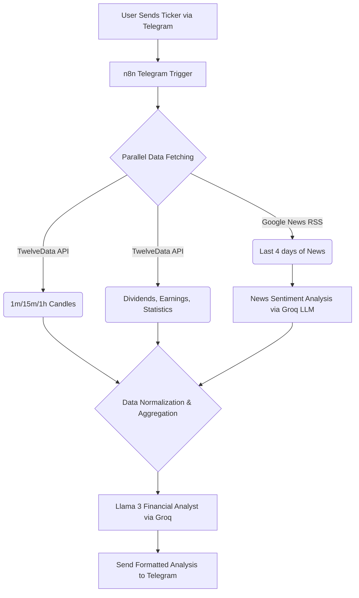

# 📈 Telegram AI Stock Analyst (n8n + Groq Llama 3)

A completely free, serverless, intelligent stock analysis agent that delivers comprehensive trading and investment recommendations directly to your Telegram. 

Simply message your Telegram bot with a stock ticker (e.g., "AAPL") and within five seconds, it orchestrates a complete financial deep-dive—combining real-time technical indicators, news sentiment, and long-term fundamental data using Meta's Llama 3 AI via Groq.

---

## 🎯 Overview

This bot automates the tedious stock research process. Instead of checking TradingView, Yahoo Finance, and Google News manually, this single n8n workflow does it all instantly.

### Core Capabilities
- 📱 **Telegram Interface** — Access analysis anywhere via your phone.
- ⚡ **Zero Latency AI** — Powered by Groq's LPU architecture running Meta's Llama 3.
- 📉 **Real-Time Technicals** — Live price action across 1m, 15m, and 1h timeframes.
- 📰 **News Sentiment** — Instantly reads the last 4 days of news to generate a market sentiment score.
- 💼 **Fundamental Metrics** — Calculates expected annual return via P/E ratios, earnings growth, and dividend yield.
- 💸 **100% Free** — Bypasses costly AI API limits by using Groq's generous free tier.

---

## 🏗️ Architecture



---

## 🚀 Setup Guide

### Prerequisites
- [n8n](https://n8n.io/) instance (Desktop or Cloud)
- Telegram account
- Free API keys (see below)

### API Keys Required (All 100% Free)

| Service | Purpose | Get It Here |
|---------|---------|-------------|
| **TwelveData** | Stock market data (candles, stats) | [twelvedata.com](https://twelvedata.com/) |
| **NewsAPI** | Fallback news articles | [newsapi.org](https://newsapi.org/) |
| **Groq** | Lightning-fast AI (Llama 3) | [console.groq.com](https://console.groq.com/) |
| **Telegram** | Bot platform | BotFather on Telegram |

### Step 1: Create Telegram Bot
1. Open Telegram and message **@BotFather**.
2. Send `/newbot` command and choose a name.
3. Save the bot token provided.
4. Get your numeric Telegram user ID from **@userinfobot**.

### Step 2: Import Workflow
1. Download `uS-stocks-workflow-Groq-Final.json` from this repository.
2. Open your n8n instance.
3. Go to **Workflows → Import from File**.
4. Select the JSON file and click **Import**.

### Step 3: Embed Your API Keys
1. **Telegram Trigger Node:** Double click, add your Telegram Credential, and insert your specific Numeric Telegram User ID (to ensure the bot only listens to you).
2. **Sentiment Analysis Node (Code):** Open the node and replace the `GROQ_API_KEY` placeholder variable at the bottom with your actual Groq API key snippet.
3. **Groq Chat Model Node:** Click "Credential to connect with", add a Groq API Credential, and paste your key.

*(Note: TwelveData and NewsAPI keys are already pre-embedded in the HTTP requests for ease of deployment, but you can swap them for your own if you hit the daily rate limits).*

### Step 4: Activate 
1. Click the **Active** toggle in the top-right corner of n8n.
2. Open Telegram and message your bot: `TSLA`!

---

## 📊 Sample Output

```text
📈 TSLA (Tesla Inc) ANALYSIS

### COMPANY INFORMATION
- Sector: Consumer Cyclical
- Industry: Auto Manufacturers

### SHORT-TERM TRADING (Day Trading)
- Technical Recommendation: BUY
- Entry Price: $185.20
- Stop-Loss: $183.50
- Target Price: $192.00
- Trading Rationale: Strong support off the 1h moving average with bullish 15m engulfing candles. Immediate news sentiment is surprisingly positive (+0.8 score) following recent factory announcements.

### LONG-TERM INVESTMENT
- Investment Recommendation: HOLD
- Expected Annual Return: 12.5%
- P/E Ratio: 45.3
- Key Strengths: Dominant EV market share, robust energy storage growth.
- Key Risks: Margin compression, high valuation multiple.
- Investment Rationale: While growth remains strong, the current P/E suggests much of the near-term upside is priced in. Better to hold current positions rather than initiating new long-term buys at this level.

### OVERALL ASSESSMENT
- Risk Level: HIGH
- Time Horizon: SHORT-TERM
```

---

## 🛠️ Lessons Learned
- **Token Economy:** Passing hundreds of financial data points to an AI eats up API limits instantly. This workflow was specifically optimized to restrict candlestick lookbacks to exactly 15 periods, preventing `429 Too Many Requests` crashing.
- **Workflow Architecture:** Standard "Agent" loops often fail and infinitely retry when dealing with strict JSON output parsing. Replacing the Agent loop with a strict sequential **Basic LLM Chain** guaranteed exactly 1 API call per run, ensuring massive stability.

---

## 📄 License
This project is licensed under the **MIT License**.

> ⚠️ **Disclaimer:** This tool provides analysis for educational and informational purposes only. It is not financial advice. Always do your own research and consult with licensed financial advisors before making investment decisions.
